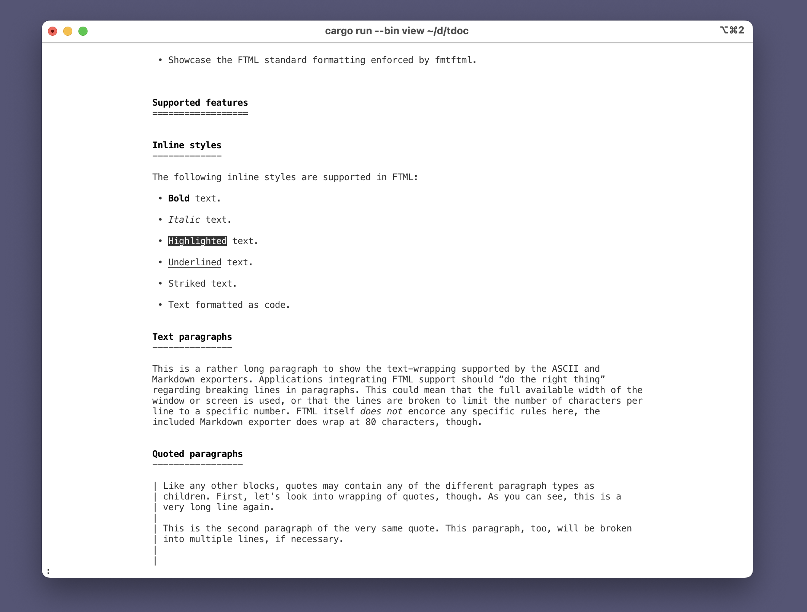

# tdoc

[](https://github.com/roblillack/tdoc/actions)
[](https://crates.io/crates/tdoc)
[](https://crates.io/crates/tdoc)
[](https://docs.rs/tdoc)

A command-line tool and Rust library for handling all kinds of text documents (Markdown, HTML, FTML - Formatted Text Markup Language).

This project is a partial rewrite of the Go library available at https://github.com/roblillack/ftml, bringing FTML support to the Rust ecosystem with improved performance and memory safety.



## CLI usage

`tdoc` is the unified CLI for viewing and exporting FTML, HTML, and Markdown content.
When no input path is provided it reads from stdin. The output format is detected
from the `--output/-o` file extension.

```bash
# View a local FTML file with ANSI styling (defaults to a pager)
tdoc document.ftml

# View a local Markdown file with ANSI styling
tdoc notes.md

# View a local HTML file with ANSI styling
tdoc email.html

# View from a URL
tdoc https://example.com/document.html

# Disable ANSI formatting (disables the pager and emits ASCII)
tdoc --no-ansi document.ftml

# Read from stdin (defaults to FTML)
cat document.ftml | tdoc

# Force the input format for stdin/unknown extensions
cat notes.md | tdoc --input-format markdown

# Export to different formats (extension determines the output)
tdoc paper.ftml --output paper.md      # Markdown
tdoc paper.ftml --output paper.ftml    # FTML
tdoc paper.ftml --output paper.html    # HTML
tdoc paper.ftml --output paper.txt     # Wrapped ASCII text
```

## What is FTML?

**FTML (Formatted Text Markup Language)** is a lightweight document format designed for simplicity and ease of processing. As a **strict subset of HTML5**, it remains fully compatible with standard web technologies while being far easier to parse and work with programmatically. FTML provides the essential features needed for rich text documents—such as paragraph structures, headings, lists, and inline styles—without the complexity of full HTML or Markdown. It’s ideal for straightforward text content like emails, memos, notes, and help documentation.

**Key features:**

- **Simple structure**: Only the most essential formatting options
- **HTML-compatible**: Valid FTML is valid HTML5
- **Diffable**: Designed to work well with version control
- **Unambiguous**: Usually only one way to express something

For the full FTML specification, see the [original repository](https://github.com/roblillack/ftml).

## Features

tdoc provides a comprehensive toolkit for working with FTML documents in Rust:

- **Load and Save**: Parse FTML documents from files or streams, and write them back with proper formatting
- **Terminal Rendering**: Render documents to terminal screens with full support for ASCII/ANSI formatting, including **bold**, _italic_, <u>underline</u>, <del>strikethrough</del>, <mark>highlight</mark>, `code`, [clickable links](https://github.com/roblillack/tdoc) and all supported paragraph types
- **Format Conversion**: Convert between FTML and other formats:
  - **Markdown**: Export FTML documents to Markdown for compatibility with documentation systems
  - **HTML**: Import HTML documents into FTML (basic support), with plans for full HTML export
- **Document Manipulation**: Build and modify FTML documents programmatically with a clean, type-safe API
- **Inline FTML macro**: Compose FTML document trees inline with the `ftml!` macro for ergonomic test fixtures and examples
- **Command-line Tools**: Ready-to-use CLI utilities for viewing, converting, and formatting FTML documents

## Document Structure

FTML documents consist of a hierarchy of elements:

### Block-level Elements

- **Text paragraphs** (`<p>`)
- **Headers** (`<h1>`, `<h2>`, `<h3>`)
- **Lists** - ordered (`<ol>`) or unordered (`<ul>`)
- **Blockquotes** (`<blockquote>`)

### Inline Styles

Text spans can have optional styles:

- **Bold** (`<b>`)
- **Italic** (`<i>`)
- **Underline** (`<u>`)
- **Strike** (`<s>`)
- **Highlight** (`<mark>`)
- **Code** (`<code>`)
- **Links** (`<a href="...">`)

### Hyperlink Rendering

- ANSI output wraps link text in OSC 8 escape codes to create clickable hyperlinks in supporting terminals.
- ASCII output elides escape codes and appends numbered references; superscript numerals are used by default, with bracketed markers available through `FormattingStyle::link_index_format`.
- Links without visible content collapse to their normalized target so empty anchors remain discoverable.
- `mailto:` links with matching descriptions reuse their text instead of adding redundant indices.

### Example Document

```ftml
<h1>This <i>very</i> simple example shows ...</h1>
<p>How FTML really is this:</p>
<ul>
  <li><p>A <mark>strict</mark> subset of HTML,</p></li>
  <li><p>That is <b>easy</b> to wrap your head around.</p></li>
</ul>
```

## Library Usage

### Reading Documents

```rust
use tdoc::{parse, Document};
use std::fs::File;

fn main() -> Result<(), Box<dyn std::error::Error>> {
    // Parse from a file
    let file = File::open("document.ftml")?;
    let document = parse(file)?;

    // Access document structure
    for paragraph in &document.paragraphs {
        println!("Paragraph type: {}", paragraph.paragraph_type);
    }

    Ok(())
}
```

### Writing Documents

```rust
use tdoc::{write, Document, Paragraph, Span};
use std::io::stdout;

fn main() -> Result<(), Box<dyn std::error::Error>> {
    // Create a document programmatically
    let mut doc = Document::new();

    let paragraph = Paragraph::new_text()
        .with_content(vec![
            Span::new_text("Hello, "),
            Span::new_styled(tdoc::InlineStyle::Bold)
                .with_children(vec![Span::new_text("world!")]),
        ]);

    doc.add_paragraph(paragraph);

    // Write to stdout
    write(&mut stdout(), &doc)?;

    Ok(())
}
```

### Building with the `ftml!` macro

```rust
use tdoc::{ftml, write};

fn main() -> tdoc::Result<()> {
    // Compose a document inline, similar to RSX or JSX
    let doc = ftml! {
        h1 { "Hello World!" }
        ul {
            li {
                p { "This is a text paragraph inside a list item" }
                quote { p { "And this is a quoted paragraph in the same item" } }
            }
        }
        p { "Inline styles work " b { "just as well" } "." }
    };

    write(&mut std::io::stdout(), &doc)?;
    Ok(())
}
```

### Exporting to Markdown

```rust
use tdoc::{parse, markdown};
use std::fs::File;

fn main() -> Result<(), Box<dyn std::error::Error>> {
    let file = File::open("document.ftml")?;
    let document = parse(file)?;

    // Export to Markdown
    markdown::write(&mut std::io::stdout(), &document)?;

    Ok(())
}
```

### Importing from HTML

```rust
use tdoc::html;
use std::fs::File;

fn main() -> Result<(), Box<dyn std::error::Error>> {
    let file = File::open("document.html")?;
    let document = html::parse(file)?;

    // Now you have an FTML document
    println!("Parsed {} paragraphs", document.paragraphs.len());

    Ok(())
}
```

## Implementation Status

This Rust implementation is a work in progress. Here's how it compares to the [Go version](https://github.com/roblillack/ftml):

| Feature                | Rust (tdoc) | Go (ftml)     | Notes                                     |
| ---------------------- | ----------- | ------------- | ----------------------------------------- |
| **Core Library**       |             |               |                                           |
| FTML Parsing           | ✅ Full     | ✅ Full       | Both implementations complete             |
| FTML Writing           | ✅ Full     | ✅ Full       | Both implementations complete             |
| **Terminal Rendering** |             |               |                                           |
| ASCII Support          | ✅ Full     | ✅ Full       | Both implementations complete             |
| ANSI Support           | ✅ Full     | ✅ Full       | Both implementations complete             |
| **Import/Export**      |             |               |                                           |
| Markdown Import        | ✅ Full     | ❌ Planned    | Only Rust version has implementation      |
| Markdown Export        | ✅ Full     | ✅ Full       | Both implementations complete             |
| HTML Import            | ✅ Full     | ✅ Full       | Both implementations complete             |
| HTML Export            | ⚠️ Basic    | ✅ Full       | `tdoc` wraps canonical FTML in HTML       |
| **CLI Tools**          |             |               |                                           |
| Document Viewer        | ✅ `tdoc`   | ✅ `viewftml` | Both with terminal formatting             |
| Format Converter       | ✅ `tdoc`   | ✅ `ftml2md`  | Go version only supports FTML to Markdown |
| Formatter              | ✅ `tdoc`   | ✅ `ftmlfmt`  | Both support FTML formatting              |
| **Advanced Features**  |             |               |                                           |
| URL Fetching           | ✅ Yes      | ✅ Yes        | `tdoc` & `viewftml` can fetch from URLs   |
| Paged Output           | ✅ Yes      | ✅ Yes        | Both support pager integration            |

## Building from Source

```bash
# Build the library and all tools
cargo build --release

# Run tests
cargo test

# Build specific binary
cargo build --release --bin tdoc
```

## License

MIT

## Contributing

This is a work in progress. Contributions are welcome! Please see the [original FTML repository](https://github.com/roblillack/ftml) for the specification details.
