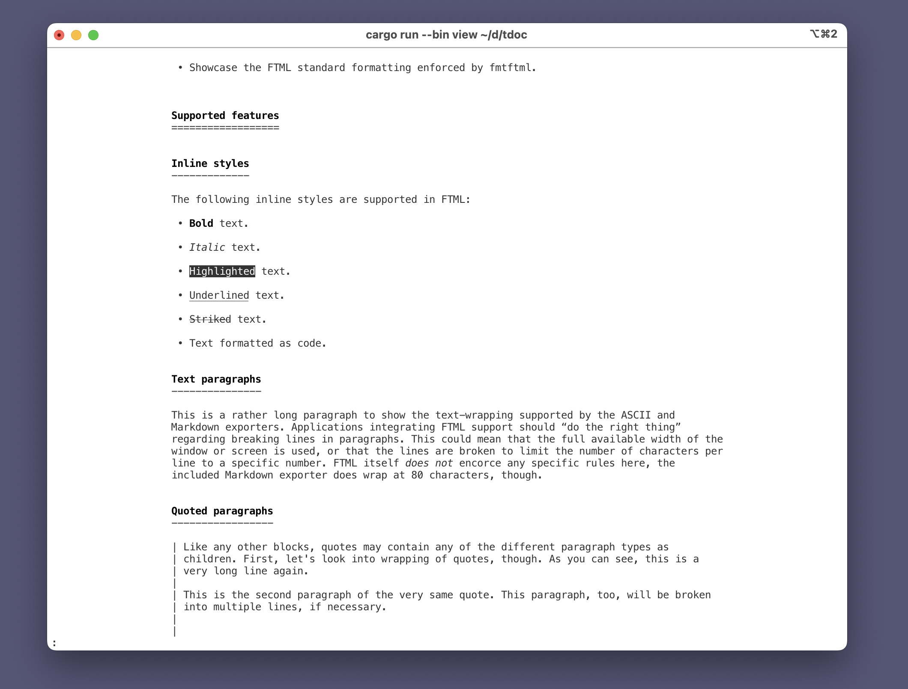

# tdoc

[](https://github.com/roblillack/tdoc/actions)
[](https://crates.io/crates/tdoc)
[](https://crates.io/crates/tdoc)
[](https://docs.rs/tdoc)

A command-line tool and Rust library for reading, rendering, and converting text
documents — across Markdown, HTML, Gemini, and FTML.

Point `tdoc` at a file, a URL, or stdin and it renders the content as richly styled
terminal output, or converts it from one format into another. Every supported format
is parsed into a single in-memory document tree, so anything tdoc can read it can also
render and re-emit in any other format it knows.

tdoc began as a Rust rewrite of the Go [ftml](https://github.com/roblillack/ftml)
library — and still handles FTML as a first-class format — but it has since grown into
a general-purpose text document toolkit where FTML is simply one of the formats it
happens to support.



## CLI usage

`tdoc` is a single binary for viewing and converting Markdown, HTML, Gemini, and FTML.
When no input path is provided it reads from stdin. The input format is detected from the
file extension (override it with `--input-format`), and the output format is detected from
the `--output`/`-o` file extension.

```bash
# View a local file with ANSI styling (defaults to a pager)
tdoc notes.md
tdoc email.html
tdoc capsule.gmi
tdoc document.ftml

# View from a URL
tdoc https://example.com/document.html

# Disable ANSI formatting (disables the pager and emits ASCII)
tdoc --no-ansi notes.md

# Read from stdin (defaults to FTML; override with --input-format)
cat notes.md | tdoc --input-format markdown

# Convert between formats (the output extension picks the target)
tdoc paper.md   --output paper.html    # Markdown -> HTML
tdoc paper.html --output paper.md      # HTML -> Markdown
tdoc paper.ftml --output paper.gmi     # FTML -> Gemini
tdoc paper.md   --output paper.txt     # Wrapped ASCII text

# Watch the input and refresh live (Ctrl-C to stop)
tdoc notes.md --watch                  # re-render in the pager on every change
tdoc paper.md --output paper.html -w   # regenerate the output file on every change
```

The `--watch`/`-w` flag keeps `tdoc` running and re-reads the input file whenever it
changes on disk. Without `--output` it refreshes the live terminal view (preserving your
scroll position); with `--output` it regenerates the output file. Watching requires a file
input — it isn't available for stdin or URLs.

## Features

tdoc provides a comprehensive toolkit for working with text documents in Rust:

- **Read and Write**: Parse documents from files, URLs, or streams, and write them back with proper formatting
- **Terminal Rendering**: Render documents to terminal screens with full support for ASCII/ANSI formatting, including **bold**, _italic_, <u>underline</u>, <del>strikethrough</del>, <mark>highlight</mark>, `code`, [clickable links](https://github.com/roblillack/tdoc), tables, checklists, and all supported paragraph types
- **Format Conversion**: Convert between formats with a shared document model:
  - **Markdown**: Import and export Markdown documents with full round-trip support
  - **Gemini**: Import and export Gemini text (.gmi) documents with full round-trip support
  - **FTML**: Import and export FTML (a strict subset of HTML5) with full round-trip support
  - **HTML**: Import HTML documents (basic support), with plans for full HTML export
- **Document Manipulation**: Build and modify documents programmatically with a clean, type-safe API
- **Inline `doc!` macro**: Compose document trees inline for ergonomic test fixtures and examples (with a strict `ftml!` variant)
- **Command-line Tool**: A ready-to-use CLI for viewing, converting, and formatting documents

## Supported formats

Every format tdoc understands maps onto the same in-memory document tree, so any supported
input can be rendered to the terminal or converted to any supported output:

- **Markdown** — the familiar lightweight markup, including task lists and tables
- **HTML** — imported into the document tree (basic support)
- **Gemini** (`.gmi`) — the text format of the Gemini protocol
- **FTML** — Formatted Text Markup Language (see below)

### What is FTML?

**FTML (Formatted Text Markup Language)** is a lightweight document format designed for simplicity and ease of processing. As a **strict subset of HTML5**, it stays fully compatible with standard web technologies while being far easier to parse and work with programmatically. It provides the essentials of rich text — paragraphs, headings, lists, and inline styles — without the complexity of full HTML, which makes it well suited to emails, memos, notes, and help documentation. FTML is also **diffable** (designed to work well with version control) and **unambiguous** (usually only one way to express something).

For the full FTML specification, see the [original repository](https://github.com/roblillack/ftml).

## Document model

Whatever format you read, tdoc parses it into the same document tree, a hierarchy of elements
(shown here with their FTML/HTML tags):

### Block-level Elements

- **Text paragraphs** (`<p>`)
- **Headers** (`<h1>`, `<h2>`, `<h3>`)
- **Code blocks** (`<pre>`)
- **Lists** - ordered (`<ol>`) or unordered (`<ul>`)
- **Checklists** (`<ul>` whose items begin with checkboxes, or Markdown `- [ ]` task lists)
- **Blockquotes** (`<blockquote>`)
- **Tables** (`<table>`)
- **Horizontal rules** (HTML `<hr>`, Markdown `---`)
- **Definition lists** (HTML `<dl>`, Markdown `Term`/`: definition`)

### Horizontal Rules

A horizontal rule is a thematic break between sections. It is parsed from `<hr>`
in HTML and from `---`/`***`/`___` in Markdown, and is written back out as
`<hr />` (HTML) or `---` (Markdown). Like tables, it is a tdoc extension rather
than part of strict FTML: build one with the `hr {}` block in the
[`doc!`](https://docs.rs/tdoc/latest/tdoc/macro.doc.html) macro (the strict
[`ftml!`](https://docs.rs/tdoc/latest/tdoc/macro.ftml.html) macro rejects it),
and note that **FTML has no thematic-break element**, so rules are dropped when a
document is exported to FTML. In the terminal a rule renders as a dim, centered
run of Unicode line characters around a spaced bullet (`───── • ─────`) with a
blank line of breathing room above and below. Gemtext likewise has no
thematic-break construct, so on Gemini export a rule degrades to a plain-text
`---` divider.

### Definition Lists

A definition list pairs one or more terms with a definition. It is parsed
from `<dl>`/`<dt>`/`<dd>` in HTML and from the PHP Markdown Extra syntax in
Markdown, where a term sits on its own line and each description that follows is
introduced by a `: ` marker:

```markdown
Coffee
: A hot black beverage

Milk
: A cold white beverage
: Best served chilled
```

Each item carries a single definition, held as a list of block paragraphs;
consecutive terms share the definition that follows them. When a source lists
several definitions for the same term (multiple `<dd>`s, or multiple `: ` lines),
they are folded into that one definition as separate paragraphs. Like tables and
horizontal rules, definition lists are a tdoc extension rather than part of
strict FTML: build one with the `dl { item { term { … } def { … } } }` block in
the [`doc!`](https://docs.rs/tdoc/latest/tdoc/macro.doc.html) macro (the strict
[`ftml!`](https://docs.rs/tdoc/latest/tdoc/macro.ftml.html) macro rejects it).
Because **FTML has no definition-list element**, exporting to FTML flattens each
term and definition paragraph into its own `<p>` (the same way tables are
flattened), preserving the text. **Gemtext** likewise has no such construct, so
on Gemini export the list degrades to plain text with each term on its own line
and its definition indented beneath it. In the terminal, terms are shown in bold
at the left margin with their definition indented below.

### Checklists

Task lists are a special kind of unordered list whose entries start with checkbox inputs (HTML/FTML) or Markdown’s `- [ ]` syntax. tdoc keeps those entries intact—including deeply nested child tasks—across the parser, Markdown/HTML writers, and the terminal formatter. That means you can read Markdown like this:

```markdown
- [x] Ship release
  - [ ] Update screenshots
  - [x] Publish announcement
```

### Code Blocks

- Represented in FTML/HTML as `<pre>` elements and emitted via the `code { "..." }` block in the `doc!`/`ftml!` macros.
- When rendered in ASCII or ANSI, code blocks maintain paragraph spacing and are wrapped in `----` separators with hard character-level wrapping.
- Markdown export uses fenced code blocks (`````), and the HTML/FTML writers preserve the original whitespace verbatim.

### Inline Styles

Text spans can have optional styles:

- **Bold** (`<b>`)
- **Italic** (`<i>`)
- **Underline** (`<u>`)
- **Strike** (`<s>`)
- **Highlight** (`<mark>`)
- **Code** (`<code>`)
- **Links** (`<a href="...">`)

### Hyperlink Rendering

- ANSI output wraps link text in OSC 8 escape codes to create clickable hyperlinks in supporting terminals.
- ASCII output elides escape codes and appends numbered references; superscript numerals are used by default, with bracketed markers available through `FormattingStyle::link_index_format`.
- Links without visible content collapse to their normalized target so empty anchors remain discoverable.
- `mailto:` links with matching descriptions reuse their text instead of adding redundant indices.

### Example Document

```ftml
<h1>This <i>very</i> simple example shows ...</h1>
<p>How an FTML document looks:</p>
<ul>
  <li><p>A <mark>strict</mark> subset of HTML,</p></li>
  <li><p>That is <b>easy</b> to wrap your head around.</p></li>
</ul>
```

## Library Usage

Each format lives in its own module (`tdoc::ftml`, `tdoc::markdown`, `tdoc::gemini`, and
`tdoc::html`), and every module exposes a `parse` function returning a `Document` and a
`write` function to emit one.

### Reading Documents

```rust
use tdoc::markdown;
use std::fs::File;

fn main() -> tdoc::Result<()> {
    // Parse from a file (swap `markdown` for `ftml`, `gemini`, or `html`)
    let file = File::open("notes.md")?;
    let document = markdown::parse(file)?;

    // Access document structure
    for paragraph in &document.paragraphs {
        println!("Paragraph type: {}", paragraph.paragraph_type());
    }

    Ok(())
}
```

### Writing Documents

```rust
use tdoc::{ftml, Document, Paragraph, Span};
use std::io::stdout;

fn main() -> tdoc::Result<()> {
    // Create a document programmatically
    let mut doc = Document::new();

    let paragraph = Paragraph::new_text()
        .with_content(vec![
            Span::new_text("Hello, "),
            Span::new_styled(tdoc::InlineStyle::Bold)
                .with_children(vec![Span::new_text("world!")]),
        ]);

    doc.add_paragraph(paragraph);

    // Write it out as FTML
    ftml::write(&mut stdout(), &doc)?;

    Ok(())
}
```

### Building with the `doc!` macro

```rust
use tdoc::{doc, ftml};

fn main() -> tdoc::Result<()> {
    // Compose a document inline, similar to RSX or JSX
    let document = doc! {
        h1 { "Hello World!" }
        ul {
            li {
                p { "This is a text paragraph inside a list item" }
                quote { p { "And this is a quoted paragraph in the same item" } }
            }
        }
        p { "Inline styles work " b { "just as well" } "." }
        table {
            row { th { "Feature" } th { "Status" } }
            row { td { "Tables" } td { "Supported" } }
        }
        dl {
            item {
                term { "tdoc" }
                def { p { "A text document toolkit" } }
            }
        }
    };

    ftml::write(&mut std::io::stdout(), &document)?;
    Ok(())
}
```

`doc!` understands tdoc's full element set. Use the [`ftml!`](https://docs.rs/tdoc/latest/tdoc/macro.ftml.html)
macro instead when you want the document restricted to strict FTML — it accepts
the same syntax but rejects extensions such as `table` at compile time.

### Converting between formats

```rust
use tdoc::{markdown, gemini};
use std::fs::File;

fn main() -> tdoc::Result<()> {
    // Read Markdown ...
    let file = File::open("notes.md")?;
    let document = markdown::parse(file)?;

    // ... and write it back out as Gemini
    gemini::write(&mut std::io::stdout(), &document)?;

    Ok(())
}
```

### Importing from HTML

```rust
use tdoc::html;
use std::fs::File;

fn main() -> tdoc::Result<()> {
    let file = File::open("document.html")?;
    let document = html::parse(file)?;

    println!("Parsed {} paragraphs", document.paragraphs.len());

    Ok(())
}
```

## Format & feature support

tdoc descends from the Go [ftml](https://github.com/roblillack/ftml) library, and a few
capabilities are still being filled in. Here is where each one stands, compared with the
Go version:

| Feature                | Rust (tdoc) | Go (ftml)     | Notes                                     |
| ---------------------- | ----------- | ------------- | ----------------------------------------- |
| **Core Library**       |             |               |                                           |
| FTML Parsing           | ✅ Full     | ✅ Full       | Both implementations complete             |
| FTML Writing           | ✅ Full     | ✅ Full       | Both implementations complete             |
| **Terminal Rendering** |             |               |                                           |
| ASCII Support          | ✅ Full     | ✅ Full       | Both implementations complete             |
| ANSI Support           | ✅ Full     | ✅ Full       | Both implementations complete             |
| **Import/Export**      |             |               |                                           |
| Markdown Import        | ✅ Full     | ❌ Planned    | Only Rust version has implementation      |
| Markdown Export        | ✅ Full     | ✅ Full       | Both implementations complete             |
| Gemini Import          | ✅ Full     | ❌ None       | Only Rust version has implementation      |
| Gemini Export          | ✅ Full     | ❌ None       | Only Rust version has implementation      |
| HTML Import            | ✅ Full     | ✅ Full       | Both implementations complete             |
| HTML Export            | ⚠️ Basic    | ✅ Full       | `tdoc` wraps canonical FTML in HTML       |
| **CLI Tools**          |             |               |                                           |
| Document Viewer        | ✅ `tdoc`   | ✅ `viewftml` | Both with terminal formatting             |
| Format Converter       | ✅ `tdoc`   | ✅ `ftml2md`  | Go version only supports FTML to Markdown |
| Formatter              | ✅ `tdoc`   | ✅ `ftmlfmt`  | Both support FTML formatting              |
| **Advanced Features**  |             |               |                                           |
| URL Fetching           | ✅ Yes      | ✅ Yes        | `tdoc` & `viewftml` can fetch from URLs   |
| Paged Output           | ✅ Yes      | ✅ Yes        | Both support pager integration            |

## Building from Source

```bash
# Build the library and the CLI
cargo build --release

# Run tests
cargo test

# Build just the CLI binary
cargo build --release --bin tdoc

# Build without network/URL support (drops the reqwest/rustls dependencies)
cargo build --release --no-default-features
```

## License

MIT

## Contributing

Contributions are welcome! For the FTML format details, see the [original FTML repository](https://github.com/roblillack/ftml) for the specification.
